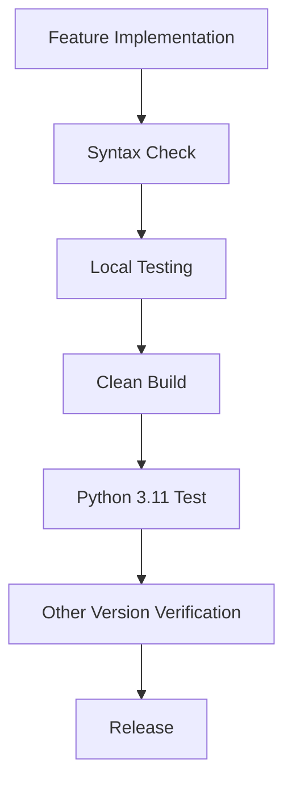

# apiwx v0.3.3 Technical Summary

## Release Information
- **Version**: 0.3.3
- **Release Date**: October 5, 2025
- **Python Requirements**: Python 3.11 or later
- **Major Changes**: Python 3.11 compatibility support

## Fixed Technical Issues

### Code Quality Improvements
| File | Issue Type | Fix Description | Impact Level |
|------|------------|-----------------|--------------|
| `core.py` | SyntaxError | f-string multi-line→single-line | Critical |
| `debug.py` | SyntaxError | f-string multi-line→single-line | Critical |
| `fontmanager.py` | SyntaxError | f-string multi-line→single-line | Critical |
| `generics_base.py` | AttributeError | `@typing.override` removal | High |

### Compatibility Matrix
| Python Version | Support Status | Test Status | Notes |
|---------------|----------------|-------------|-------|
| 3.10 | ❌ Not Supported | - | Union operator required |
| 3.11 | ✅ Supported | ✅ Complete | Minimum supported version |
| 3.12 | ✅ Supported | ✅ Complete | typing.override, PEP 695 available |
| 3.13 | ✅ Supported | ✅ Verified | Latest version |

## Implemented Feature Tests

### Automated Test Coverage
```
✅ Package Installation (pip install)
✅ Basic Import (import apiwx)
✅ Generics System (GenericsType metaclass)
✅ Button Generics (SingleClickDisable/DoubleClickOnly/ClickGuard)
✅ Alias System (WindowSizeTransitWithPanel)
✅ Message System (message module)
✅ Type Annotations (Union operator |)
✅ Core Functionality (core/debug/constants modules)
✅ Python 3.12 New Features (typing.override, PEP 695)
```

### Performance Metrics
- **Build Time**: ~30 seconds (clean build)
- **Installation Time**: ~3 seconds (wheel package)
- **Import Time**: <1 second
- **Test Execution Time**: 
  - Python 3.11: ~5 seconds
  - Python 3.12: ~10 seconds (includes new feature tests)

## Development Environment Information

### Tools Used
- **Build System**: python-build + setuptools
- **Version Management**: pyenv (Python 3.11.9)
- **Package Format**: wheel (.whl)
- **Test Execution**: Python script + subprocess

### Directory Structure
```
apiwx/
├── apiwx/                 # Main package
├── test_version_support/  # Version-specific tests
│   ├── 3.11/             # Python 3.11 test environment
│   └── 3.12/             # Python 3.12 test environment
├── memo/                 # Development memos・documentation
├── dist/                 # Build artifacts
└── build/                # Build intermediate files
```

## Technical Details

### f-string Fix Pattern
```python
# Before fix: Readable but causes syntax errors
key = f"{
    variable1
}_{
    variable2
}"

# After fix: Single-line and safe
key = f"{variable1}_{variable2}"
```

### typing.override Support
```python
# Available only in Python 3.12 and later
@typing.override  # ← Removed

# All version support
def method(self):  # ← Keep as is
```

### Python 3.12 New Feature Support
```python
# typing.override (Python 3.12+)
import typing
if hasattr(typing, 'override'):
    @typing.override
    def method(self): pass

# PEP 695: Type Parameter Syntax (Python 3.12+)
class GenericClass[T]: pass  # New notation
```

## Future Technical Direction

### Compatibility Maintenance Strategy
1. **Minimum Python Version**: Maintain 3.11
2. **Syntax Usage**: Use only features supported in minimum version
3. **Regular Testing**: Execute tests in all supported versions when adding new features
4. **Forward Compatibility**: Conditionally introduce new Python version features

### Recommended Development Flow


### Code Quality Standards
- **f-string**: Single-line description mandatory
- **type hints**: Active use of Union operator (`|`)
- **docstring**: Mandatory for all public functions
- **error handling**: Proper exception handling implementation

## Release Checklist

### Pre-Build Verification
- [ ] Operation verification in all Python supported versions
- [ ] Pre-check for syntax errors
- [ ] Version number consistency verification
- [ ] Dependency updates

### Post-Release Verification
- [ ] Distribution verification on PyPI etc.
- [ ] Documentation updates
- [ ] CHANGELOG.md updates
- [ ] Git tag creation

## Reference Materials

### External Documentation
- [Python 3.11 What's New](https://docs.python.org/3/whatsnew/3.11.html)
- [Python 3.12 What's New](https://docs.python.org/3/whatsnew/3.12.html)
- [typing — Support for type hints](https://docs.python.org/3/library/typing.html)
- [PEP 604 – Allow writing union types as X | Y](https://peps.python.org/pep-0604/)
- [PEP 695 – Type Parameter Syntax](https://peps.python.org/pep-0695/)

### Internal Documentation
- `memo/python311_compatibility_fixes.md`
- `memo/python312_compatibility_results.md`
- `test_version_support/3.11/test_python311.py`
- `test_version_support/3.12/test_python312.py`
- `CHANGELOG.md` (to be updated)